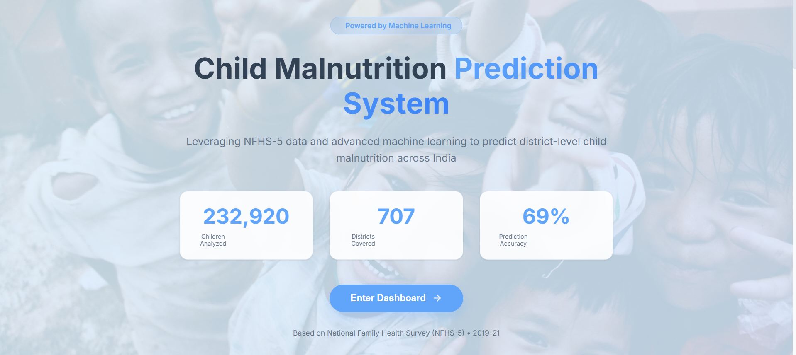
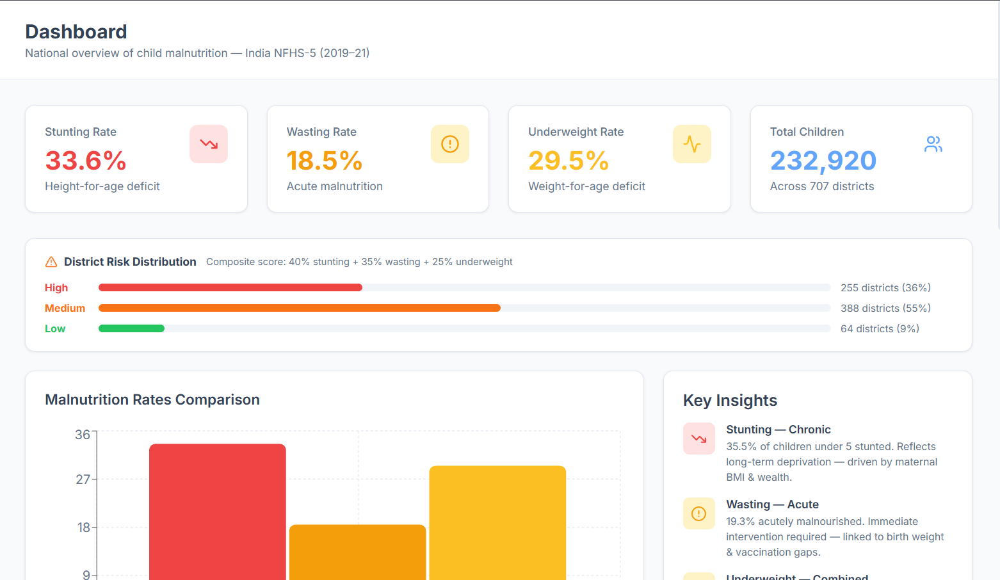
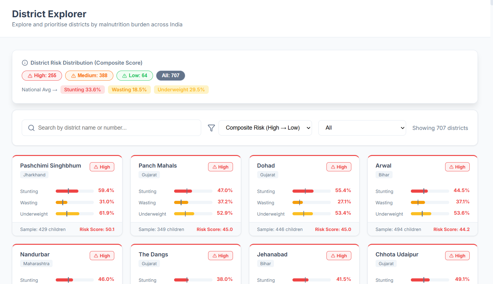
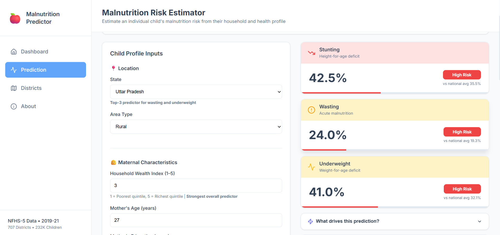
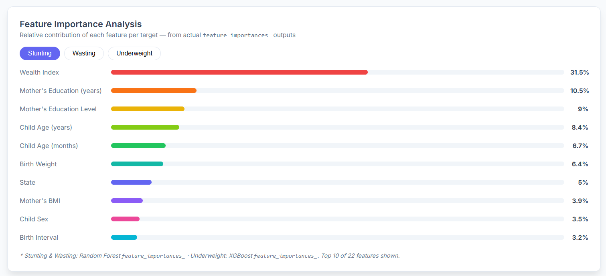
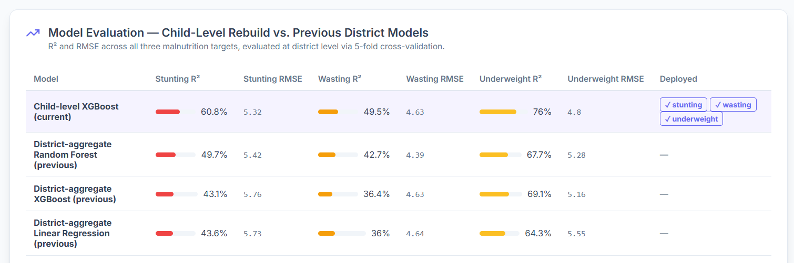

# 🩺 Child Malnutrition Prediction

A full-stack ML web application predicting child malnutrition risk across India using NFHS-5 data. Supports **individual child-level prediction** (stunting, wasting, underweight), **district-level analytics** across all 707 districts, and a **scenario simulator** for exploring how shifting one district-average factor associates with predicted rates.

**Live Demo:** [child-malnutrition-prediction.vercel.app](https://child-malnutrition-prediction.vercel.app)
**API:** [childmal-backend-1023489696573.asia-south1.run.app](https://childmal-backend-1023489696573.asia-south1.run.app)

---

## 📸 Screenshots

**Landing Page**

> 232,920 children analyzed · 707 districts covered · 76% prediction accuracy (R² underweight, child-level model)

**Dashboard — National Overview**

> National averages: Stunting 35.5% · Wasting 19.3% · Underweight 32.1% · District risk distribution across 707 districts

**District Explorer**

> Browse and filter all 707 districts by composite risk score, ranked by stunting, wasting, and underweight rates.

**Malnutrition Risk Estimator**

> Input an individual child's profile (mother's characteristics, birth history, vaccination status, state) to get predicted risk with classification vs national average.

**Scenario Simulator**

> Estimate how a district-level shift in wealth, mother's education, or BCG coverage associates with predicted malnutrition rates — one factor at a time, using a separate district-aggregate model (see below).

**Feature Importance Analysis**

> Wealth Index (31.5%) is the dominant predictor for stunting, followed by Mother's Education (10.5%) and Child Age (8.4%). State is a top-3 predictor for wasting and underweight.

**About — Model Evaluation**

> R² comparison: current child-level model vs. previous district-aggregate models.

---

## 🧠 ML Models

**v2 (current):** A single XGBoost classifier per target, trained on **232,920 individual NFHS-5 child records** (not pre-aggregated district means). Evaluated by generating out-of-fold per-child predictions via 5-fold cross-validation, then aggregating those predictions to the district level for comparison against actual district rates.

| Target | R² (district-level, 5-fold CV) | Previous (district-aggregate) |
|---|---|---|
| Stunting | **0.608** | 0.497 |
| Wasting | **0.495** | 0.427 |
| Underweight | **0.760** | 0.691 |

Full history and reasoning: see [`Notebook/03_child_level_model_rebuild.ipynb`](Notebook/03_child_level_model_rebuild.ipynb).

**19 input features** (individual child/household level): wealth index, mother's education level & years, mother's age & BMI, mother employment status, household head sex, child age (months & years), child sex, birth interval, birth weight, breastfeeding duration, BCG/DPT/Measles vaccination status, knowledge of ORS, urban/rural, and **state** (added in v2 — a top-3 predictor for wasting and underweight that the previous pipeline excluded).

**WHO z-score thresholds used:** height-for-age, weight-for-height, and weight-for-age z-scores < −2 SD define stunting, wasting, and underweight respectively.

**Risk thresholds:**
- Stunting / Underweight: Low < 20% · Medium < 35% · High ≥ 35%
- Wasting: Low < 10% · Medium < 20% · High ≥ 20%

> ⚠️ **Two data bugs fixed in v2:** the earlier pipeline's `birth_weight` field
> actually read the *mother's* weight (DHS variable `v437`), and
> `birth_interval` actually read the child's *current age* (`b8`) rather than
> the true preceding birth interval (`b11`). Both corrected — see the
> rebuild notebook for details.

**v1 (retained, powers the Scenario Simulator only):** The original district-aggregate models — Random Forest for stunting and wasting, XGBoost for underweight (`Models/v1/*.pkl`) — trained on 707 district-average rows rather than individual children. Deliberately kept and used only by `/api/simulate`: a district-averaged "what if" input matches this model's training distribution exactly, whereas feeding an averaged profile into the v2 child-level model would be out-of-distribution for it. The simulator only allows one feature to change per run, and flags (but doesn't block) scenarios where a shift is unusually large relative to how much real districts actually vary — see `backend/routers/simulate.py` for the exact logic.

---

## 📓 Notebooks

The `Notebook/` directory contains the full ML pipeline history:

| Notebook | Status | Purpose |
|---|---|---|
| `03_child_level_model_rebuild.ipynb` | **Current** | Parses raw NFHS-5 child-level microdata (DHS flat ASCII format), trains and evaluates the deployed XGBoost models, exports district-level predictions |
| `Data_exploration.ipynb` | Archived | Original district-aggregation pipeline (superseded — see deprecation notice in the notebook) |
| `02_feature_engineering_and_modeling.ipynb` | Archived | Original 9-algorithm district-level model comparison (superseded — see deprecation notice in the notebook) |

> **Note:** `Data/Raw/IAKR7EFL.*` (NFHS-5 Children's Recode, DHS flat ASCII format) is not included in this repo per DHS Program data-use terms. To re-run `03_child_level_model_rebuild.ipynb`, register at [dhsprogram.com](https://dhsprogram.com), request the India NFHS-5 (2019–21) dataset, and download the Children's Recode in "Flat ASCII data (.dat)" format into `Data/Raw/`. The processed outputs and trained models are already included so the app runs without them.

---

## 🗂 Project Structure

```
child-malnutrition/
├── backend/
│   ├── main.py                      # FastAPI entry point
│   ├── config.py                    # All paths and model file locations
│   ├── models/
│   │   └── schemas.py               # Pydantic request/response schemas (child-level input)
│   ├── services/
│   │   ├── district_mapping.py      # District & state name enrichment (state code mapping lives here)
│   │   ├── ml_models.py             # XGBoost model loading (graceful 503 on failure)
│   │   ├── ml_models_v1.py          # District-aggregate v1 model loading (Scenario Simulator only)
│   │   └── district_data.py         # District CSV loading
│   ├── routers/
│   │   ├── prediction.py            # POST /api/predict
│   │   ├── simulate.py              # POST /api/simulate (Scenario Simulator, v1 models)
│   │   ├── districts.py             # GET /api/districts, /api/districts/{id}
│   │   └── statistics.py            # GET /api/statistics
│   └── requirements.txt
├── frontend/
│   ├── src/
│   │   ├── components/
│   │   ├── pages/                   # Landing, Dashboard, DistrictExplorer, Prediction, Simulate, About
│   │   ├── services/
│   │   │   ├── api.js               # Live backend calls (predict, simulate) + static bundled district data (dashboard/explorer)
│   │   │   └── Warmup.js            # Pings /health on load + keep-alive interval; shares API_BASE_URL with api.js
│   │   ├── data/
│   │   │   └── districtData.json    # Pre-built district snapshot bundled at build time — regenerate from Data/Processed/ when data changes
│   │   └── App.js
│   └── package.json
├── Notebook/
│   ├── 03_child_level_model_rebuild.ipynb   # Current pipeline
│   ├── Data_exploration.ipynb               # Archived
│   └── 02_feature_engineering_and_modeling.ipynb  # Archived
├── Models/
│   ├── final_model_stunting.json    # Child-level XGBoost (native JSON format)
│   ├── final_model_wasting.json
│   ├── final_model_underweight.json
│   └── v1/                          # District-aggregate models (Scenario Simulator only — see ML Models)
│       ├── random_forest_stunting.pkl
│       ├── random_forest_wasting.pkl
│       └── xgboost_underweight.pkl
├── Data/
│   ├── Raw/                         # NFHS-5 DHS flat ASCII files (not in repo — see Notebooks section)
│   └── Processed/
│       ├── district_malnutrition_enhanced.csv    # 707-row training data for the v1 simulator models
│       ├── district_predictions_all_types.csv     # v2 predictions aggregated to district level (Dashboard/Explorer)
│       ├── complete_district_mapping.csv
│       ├── district_name_mapping.csv
│       └── state_level_summary.csv
└── .github/
    └── workflows/
        └── keep-alive.yml           # Prevents backend cold starts
```

> ⚠️ **Frontend data note:** the Dashboard and District Explorer pages read from the **bundled** `frontend/src/data/districtData.json`, not a live API call — this was a source of confusion during the v2 rebuild (backend data was correct but the dashboard kept showing stale numbers because this static file wasn't regenerated). If you update `Data/Processed/district_predictions_all_types.csv`, you must also regenerate `districtData.json` and redeploy the frontend — updating the backend alone is not enough for those two pages.

---

## 🚀 Getting Started

### Prerequisites

- Python 3.9+
- Node.js 18+

### 1. Clone the repo

```bash
git clone https://github.com/Vdubey165/Child-Malnutrition-Prediction.git
cd Child-Malnutrition-Prediction
```

### 2. Backend setup

```bash
cd backend
pip install -r requirements.txt
uvicorn main:app --reload
```

API will be running at `http://localhost:8000` · Docs at `http://localhost:8000/docs`

### 3. Frontend setup

```bash
cd frontend
npm install
```

Create a `.env` file in the `frontend/` directory pointing at your local or deployed backend:

```env
REACT_APP_API_URL=http://localhost:8000
```

```bash
npm start
```

Frontend will be running at `http://localhost:3000`

---

## 🔌 API Reference

| Method | Endpoint | Description |
|---|---|---|
| `GET` | `/` | API info |
| `GET` | `/health` | Health check — models & data loaded status (includes `simulator_available`) |
| `POST` | `/api/predict` | Predict stunting, wasting, underweight for an individual child |
| `POST` | `/api/simulate` | Estimate the effect of shifting one district-average feature (Scenario Simulator, v1 models) |
| `GET` | `/api/districts` | All districts (paginated via `?limit=` and `?offset=`, filter via `?state=`) |
| `GET` | `/api/districts/{id}` | Single district by ID |
| `GET` | `/api/statistics` | National averages across all 707 districts |

### Sample prediction request

```json
POST /api/predict
{
  "wealth_index": 3,
  "mother_edu_level": 1,
  "mother_age": 27,
  "mother_edu_years": 8,
  "mother_bmi": 2200,
  "mother_works": 0,
  "female_headed_hh": 1,
  "child_age_months": 30,
  "child_sex": 1,
  "child_age_years": 2,
  "birth_interval": 32,
  "birth_weight": 2800,
  "breastfeed_duration": 12,
  "bcg_vaccination": 1,
  "dpt_vaccination": 1,
  "measles_vaccination": 1,
  "knows_ors": 1,
  "urban_rural": 2,
  "state": 9
}
```

`birth_interval` can be `null` for first-born children (no preceding birth) — the backend imputes the training median in that case.

### Sample response

```json
{
  "stunting": 42.5,
  "wasting": 18.2,
  "underweight": 35.1,
  "risk_level": {
    "stunting": "High",
    "wasting": "Medium",
    "underweight": "High"
  }
}
```

### Sample simulate request

```json
POST /api/simulate
{
  "district_id": 101,
  "feature_deltas": { "wealth_index": 0.5 }
}
```

Only one feature may be changed per request — `feature_deltas` with more than one non-zero entry returns `400`. Values are clamped to that feature's observed range across all 707 districts.

### Sample simulate response

```json
{
  "district_id": 101,
  "district_name": "Example District",
  "state_name": "Example State",
  "baseline": { "stunting": 38.2, "wasting": 16.4, "underweight": 30.1 },
  "scenario": { "stunting": 35.7, "wasting": 15.9, "underweight": 27.8 },
  "delta": { "stunting": -2.5, "wasting": -0.5, "underweight": -2.3 },
  "risk_level_baseline": { "stunting": "Medium", "wasting": "Medium", "underweight": "Medium" },
  "risk_level_scenario": { "stunting": "Medium", "wasting": "Medium", "underweight": "Medium" },
  "applied_deltas": { "wealth_index": 0.5 },
  "clamped_features": {},
  "large_shift_features": {},
  "model_version": "v1-district-aggregate",
  "disclaimer": "Estimated association based on historical district-level patterns (R² 0.43–0.69 on held-out test districts), not a causal forecast. District-wide averages are not directly controllable by policy."
}
```

`large_shift_features` is populated when the applied change is more than 1 standard deviation from that feature's real spread across all districts — a soft caution, not a hard block.

---

## 🌐 Deployment

| Layer | Platform |
|---|---|
| Frontend | Vercel |
| Backend | Google Cloud Run (`childmal-backend`), built via Google Cloud Build |

A GitHub Actions workflow (`.github/workflows/keep-alive.yml`) pings the backend periodically to prevent cold starts.

---

## 📊 Data

Built on **NFHS-5 (National Family Health Survey 5, 2019–21)**, India's national health survey. The current model trains on **232,920 individual child records** (DHS Children's Recode); the previous pipeline used a 707-row district-level aggregate. Both processed datasets are included in `Data/Processed/`; raw microdata is not included (see [Notebooks](#-notebooks) for how to obtain it).

---

## 🛠 Tech Stack

- **Frontend:** React, Recharts, Lucide
- **Backend:** FastAPI, Python
- **ML:** XGBoost (native JSON format, v2 child-level models) · scikit-learn Random Forest + pickled XGBoost (v1 district-aggregate models, Scenario Simulator only)
- **Data:** Pandas, NumPy
- **Deployment:** Vercel + Google Cloud Run

---

## 👤 Author

**Vaibhav Dubey** — [github.com/Vdubey165](https://github.com/Vdubey165)